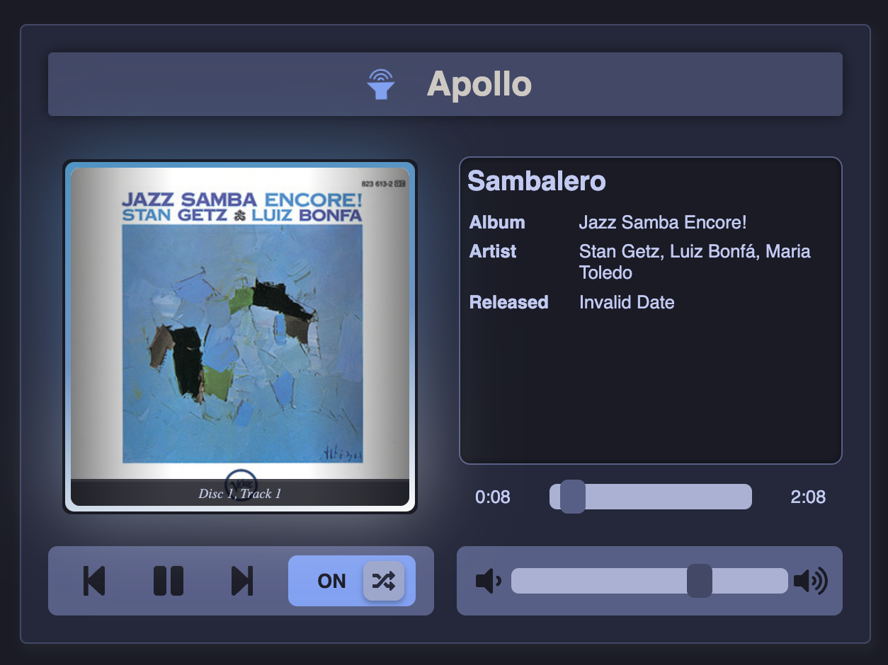
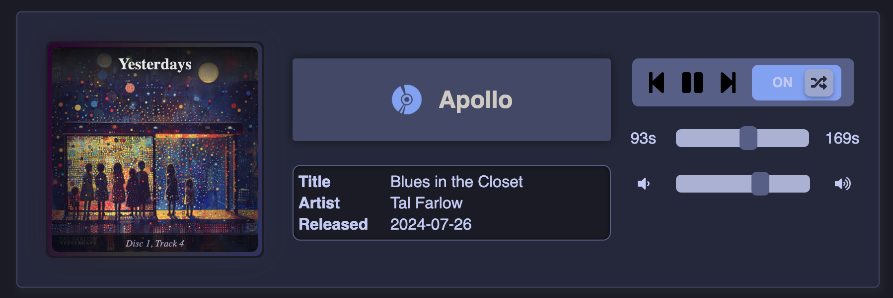
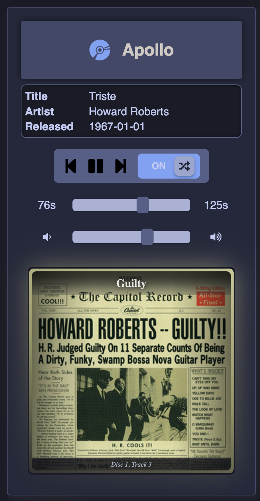

# react-librespot-controller
[](https://www.npmjs.com/package/@stronk-tech/react-librespot-controller)
[](https://www.npmjs.com/package/@stronk-tech/react-librespot-controller)
[](https://www.npmjs.com/package/@stronk-tech/react-librespot-controller)
[](https://www.npmjs.com/package/@stronk-tech/react-librespot-controller)
[](https://github.com/stronk-dev/react-librespot-controller/blob/master/LICENSE)
[](https://github.com/stronk-dev/react-librespot-controller/actions/workflows/dependabot/dependabot-updates)

> [`go-librespot`](https://github.com/devgianlu/go-librespot) squeezebox-alike web frontend for small touchscreens

Can be deployed standalone or imported as a NPM module.

The player is styled in the [Tokyo Night](https://github.com/tokyo-night/tokyo-night-vscode-theme) colour scheme except for the album image, which emits an ambilight effect based on the colours in the image.

## Install `go-librespot`
TODO: refer to OG source instructions + explain `systemd` script
```
[Unit]
Description=Spotify daemon
Documentation=https://github.com/devgianlu/go-librespot
Wants=sound.target
After=sound.target
Wants=network-online.target
After=network-online.target

[Service]
WorkingDirectory=/home/pulseaudio/go-librespot
ExecStart=/usr/local/go/bin/go run /home/pulseaudio/go-librespot/cmd/daemon
Restart=always
RestartSec=12

[Install]
WantedBy=default.target
```

## Config `go-librespot`
TODO: instructions to enable the API

Make sure to mention the bind address.

## Standalone

Create a `.env` file and fill in you API endpoints
```
REACT_APP_API_BASE_URL=http://apollo:3678
REACT_APP_WS_URL=ws://apollo:3678/events
```

Run `npm run test` for local debugging.
Run `npm run static` to generate the build folder.

TODO: build instructions

TODO: nginx instructions. Include HTTPS instructions with local IP whitelist (+hairpin nat)

TODO: OS instructions (auto-login, open browser, etc)


## Module

First install the dependency:
```
npm install --save `@stronk-tech/spotify-player`
```

Then import the component and fill in your API endpoints:
```
import MediaPlayer from "@stronk-tech/spotify-player";
<MediaPlayer websocketUrl={"ws://apollo:3678/events"} apiBaseUrl={"http://apollo:3678"} hideOnDisconnect={true} />
```

If you set `hideOnDisconnect` to true, the entire component will hide itself when there is no connection to the API endpoint. Otherwise it will display an error state (an retry the connection of course).

# Screen shots
The player arranges itself based on the screen dimensions, with three possible layouts:

### Default layout


### Widescreen


### Portrait
