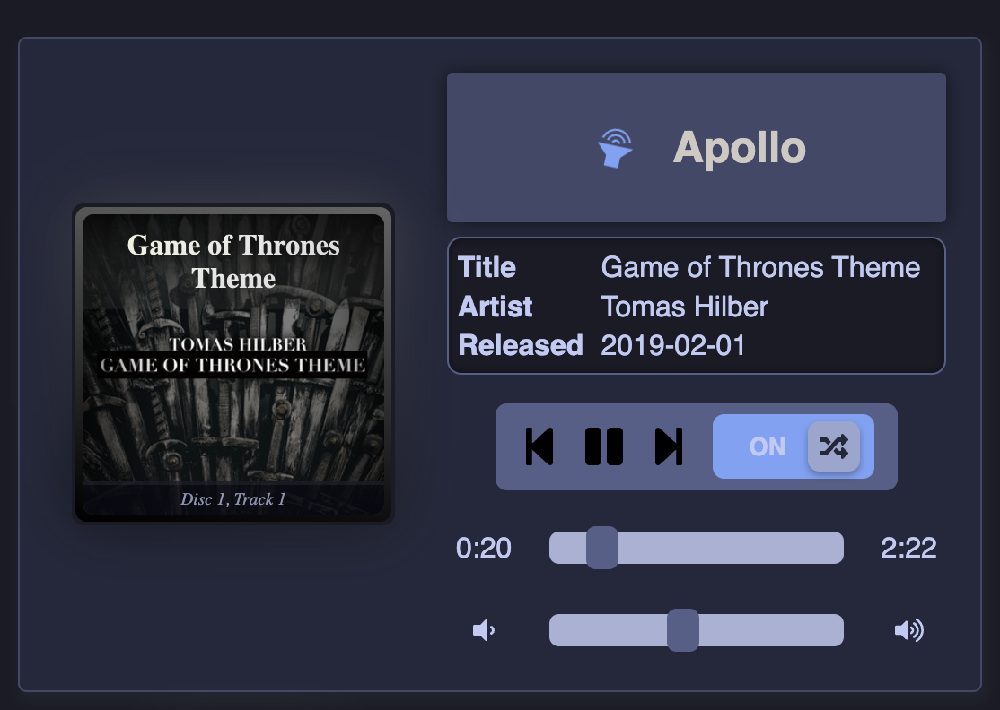

# SpotifyPlayer
[](https://www.npmjs.com/package/@stronk-tech/spotify-player)

> [`go-librespot`](https://github.com/devgianlu/go-librespot) web frontend for small touchscreens

Can be deployed standalone or imported as a NPM module.

## Install `go-librespot`
TODO: refer to OG source + example `systemd` script
```
[Unit]
Description=Spotify daemon
Documentation=https://github.com/devgianlu/go-librespot
Wants=sound.target
After=sound.target
Wants=network-online.target
After=network-online.target

[Service]
WorkingDirectory=/home/pulseaudio/go-librespot
ExecStart=/usr/local/go/bin/go run /home/pulseaudio/go-librespot/cmd/daemon
Restart=always
RestartSec=12

[Install]
WantedBy=default.target
```

## Config `go-librespot`
TODO: instructions to enable the API
Make sure to mention the bind address and to not expose API to public net.

## Standalone

Create a `.env` file and fill in the API endpoints
```
REACT_APP_API_BASE_URL=http://apollo:3678
REACT_APP_WS_URL=ws://apollo:3678/events
```

Run `npm run test` for local debugging.

## Module

First install the dependency:
```
npm install --save `StronkTech/SpotifyPlayer`
```

Then import the component, simple as that:
```
import MediaPlayer from "@stronk-tech/spotify-player";
<MediaPlayer websocketUrl={"ws://apollo:3678/events"} apiBaseUrl={"http://apollo:3678"} hideOnDisconnect={true} />
```

# Screen shots


